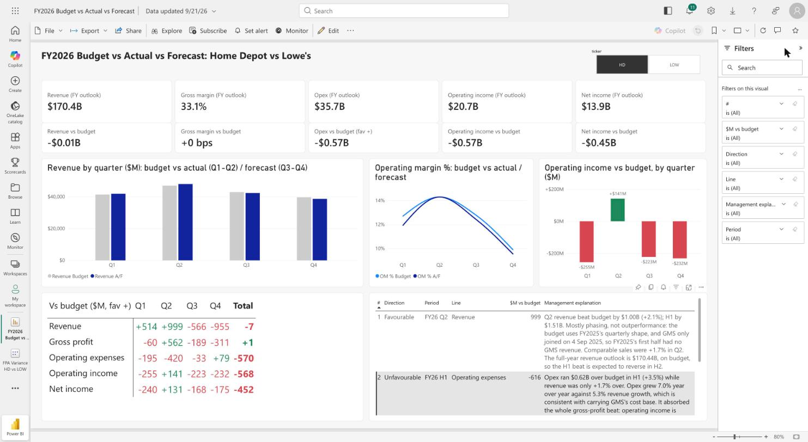

# FY2026 Budget vs Actual vs Forecast: Home Depot vs Lowe's

An FP&A variance model built from public SEC data. It covers a guidance-based FY2026 budget, H1 actuals, a driver-based H2 forecast and a Power BI dashboard with a management explanation of the largest variances.



**Stack:** SQL (DuckDB) · Excel · Power Query (Online) · Power BI (web: semantic model, DAX, TMDL) · Python

## What it answers
Halfway through FY2026, is each company on track against a budget built from its own guidance, and what explains the largest favourable and unfavourable changes?

| FY2026 outlook vs budget | Home Depot | Lowe's |
|---|---:|---:|
| Revenue | $170.4B (−$7M) | $91.6B (−$1,357M) |
| Operating income | $20.7B (−$568M) | $10.1B (−$429M) |
| Operating margin | 12.2% vs 12.5% | 11.0% vs 11.3% |
| Net income | $13.9B (−$452M) | $6.4B (−$301M) |

**Headline:** the H1 revenue "beats" at both companies are mostly phasing. HD acquired GMS (Sep 2025) and LOW acquired FBM (Oct 2025), so the FY2025 base that the budget is phased on has no acquired revenue in its first half. The real issues are margin: Home Depot's opex ran $0.62B over budget in H1, and Lowe's Q4 revenue is forecast $1.60B short. The full write-up is in the [management memo](docs/management_memo.md).

## How it's built
| Step | File | What it does |
|---|---|---|
| 1. Extract | `data/raw/sec_hd_low_income_statement.csv` | 1,376 income-statement facts from the SEC XBRL companyfacts API (10-Q/10-K, FY2020+) |
| 2. Clean quarters | `sql/01_quarters.sql` | De-duplicates restated values and derives Q4 = full year − 9-month YTD (Q4 is never filed on its own). Handles 53-week years and different tags per company |
| 3. Budget | `sql/02_budget.sql` | FY2026 guidance midpoints phased by FY2025 quarter shares. Margins keep seasonality and land on the guided full year |
| 4. Forecast + variances | `sql/03_forecast.sql` | Q3–Q4 = prior-year quarter × (1 + comp guidance) + acquisition stub. Also builds the variance tables and 12 validation checks |
| 5. Model workbook | `scripts/export_model.py` → `fpa_model.xlsx` | Star schema as Excel Tables (fact + company/period/line/scenario dimensions, commentary, assumptions, checks) plus a SUMIFS summary sheet |
| 6. Power Query | `powerbi/sec_staging.pq` | M staging step for the raw extract (typing, concept mapping, de-duplication) |
| 7. Semantic model | `powerbi/model.tmdl`, `model_format.tmdl`, `model_cards.tmdl` | Relationships, 39 DAX measures and formats, applied as TMDL scripts |
| 8. Report | Power BI service | Slicer, KPI cards, charts, variance matrix and explanation table ([build guide](powerbi/powerbi_build_guide.md)) |

Power BI reads `fpa_model.xlsx` straight from this repo through Power Query Online, so a commit to the workbook plus a dataset refresh updates the dashboard.

## Validation
`python scripts/run_all.py` rebuilds everything from the raw CSV and fails if any check fails:
- FY2025 quarters sum to the 10-K full year (within $5M of filer rounding)
- Budget revenue and operating margin tie exactly to guidance
- Opex = gross profit − operating income in every scenario
- The forecast equals actuals for closed quarters
- Every quarter has budget and forecast for all five lines

The Power BI measures were then checked against the SQL output with a DAX query (totals match to the dollar).

## Assumptions and limits
- **Guidance midpoints.** HD: +3.5% sales, 33.1% gross margin, 12.5% operating margin. LOW: $93.0B sales, 11.3% operating margin. Lowe's gives no gross-margin guidance, so it is held at FY2025 actual.
- **Quarterly, not monthly.** Public filings report quarters, and monthly splits would be fabricated.
- **Acquisition stub.** GMS FY-Apr-2025 net sales of $5.5B (GMS release) and FBM ~$6.5B pro forma revenue (per MDM) are prorated by the pre-close days in FY2025 Q3.
- **Conservative margins.** The forecast carries the full H1 margin gap into H2. Part of that gap is acquisition mix already in the H2 budget, so the true outlook likely sits between this forecast and budget margins.
- **Derived opex.** Opex = gross profit − operating income, so it moves with revenue.

## Reproduce
```bash
pip install duckdb openpyxl matplotlib
python scripts/run_all.py      # builds fpa.duckdb, prints checks, writes fpa_model.xlsx
python scripts/mockup.py       # optional: static dashboard mockups in figures/
```

*Source: SEC EDGAR XBRL company facts (CIK 0000354950, 0000060667); company Q4 FY2025 and Q2 FY2026 earnings releases. Built as a portfolio project; not investment advice.*
